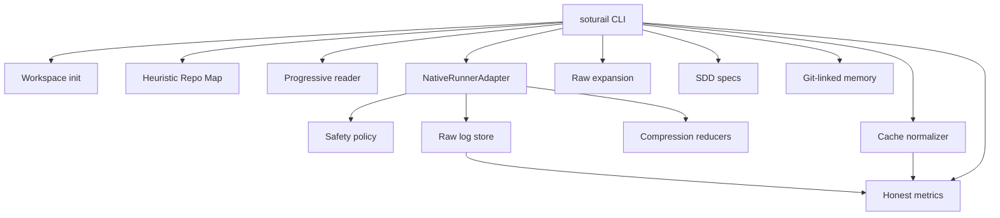

# SotuRail

SotuRail is a local-first Context OS for AI coding agents such as Claude Code, Codex CLI, Gemini CLI, Cursor and similar tools.

It adds context rails around a repository and terminal session: scan the repo without flooding the model, read large files progressively, run commands through a safe wrapper, preserve raw logs, compress terminal output, keep prompt-cache-friendly stable blocks, manage specs and memory, and report honest local metrics.

## Problem

AI coding agents are powerful, but a normal repository and shell session are noisy. Large files, long logs, repeated test output and unstable prompt payloads waste context and make debugging harder. SotuRail keeps the source of truth local and recoverable while giving agents a smaller, more stable view.

## Architecture



## Install

```bash
npm install
npm run build
npm link
soturail --help
```

For local validation without linking:

```bash
node dist/cli.js --help
```

## Quick Start

```bash
soturail init
soturail index
soturail read src/cli.ts --query "commands"
soturail run npm test
soturail expand <raw_id>
soturail stats
```

## Commands

```bash
soturail init
soturail index
soturail read <file> --query "goal"
soturail read <file> --full
soturail run <command...>
soturail run --interactive <command...>
soturail expand <raw_id>
soturail spec new "feature idea"
soturail memory add "decision or fact"
soturail memory search "term"
soturail doctor
soturail doctor cache
soturail stats
```

## Screenshot / Markdown Preview

```text
$ soturail run npm test
...live command output...

SotuRail run complete.
Exit code: 1
Compressor: test-reducer
raw_id: 6f9a2d10
Recovery: soturail expand 6f9a2d10

Test Output Summary
Raw log: soturail expand 6f9a2d10
Failures, assertions, stack traces, and file paths:
...
```

Screenshots can be placed in [docs/assets/screenshots](docs/assets/screenshots/README.md).

## Safety Model

`soturail run` blocks dangerous command patterns by default:

- `rm -rf`
- `sudo`
- `format`
- `dd if=`
- `curl | sh`
- `del /s`
- automatic `git push`

Bypass requires the exact phrase:

```bash
soturail run rm -rf tmp --unsafe-confirm "I_UNDERSTAND_THIS_CAN_DESTROY_DATA"
```

SotuRail never runs `git push` automatically.

## Prompt Caching Strategy

SotuRail keeps stable blocks before dynamic data:

1. Static header
2. Stable project governance
3. Stable config
4. Stable repo map
5. Stable approved specs
6. Stable approved memory
7. Dynamic footer

Dynamic data such as timestamps, raw ids, command status and recent logs stays after stable blocks. `doctor cache` reports an estimated local stability score only; it does not claim real provider cache hits.

## Roadmap

See [ROADMAP.md](ROADMAP.md). v0.2.0 is planned around richer ignore behavior, stronger reducers, provider metadata import, and a more ergonomic context payload command.

## Resumo em Portugues

SotuRail e um Context OS local-first para agentes de IA de desenvolvimento. Ele organiza contexto do repositorio, le arquivos grandes progressivamente, executa comandos com logs brutos recuperaveis e separa blocos estaveis de dados dinamicos para melhorar reutilizacao de prompt.

Leia tambem: [docs/pt-BR/visao-geral.md](docs/pt-BR/visao-geral.md).

## License

MIT © Rafael Ryan Ramos de Souza
