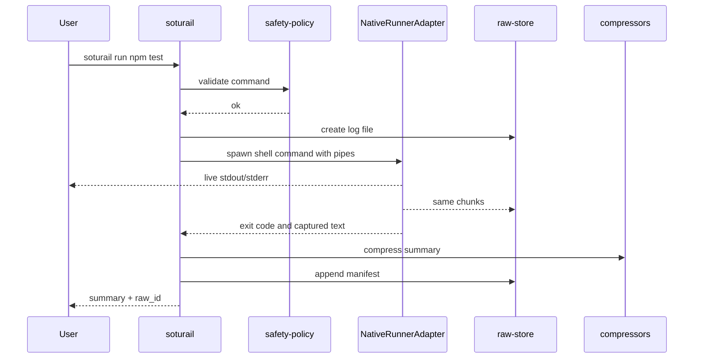

# Architecture

SotuRail v0.1.0 is a TypeScript/Node.js local-first CLI. It stores all runtime state in `.soturail/` inside the repository.

## Runtime Areas

- `.soturail/config/config.json` - validated Zod config.
- `.soturail/indexes/` - Heuristic Repo Map artifacts.
- `.soturail/raw/` - raw command logs and manifest.
- `.soturail/metrics/events.jsonl` - append-only local events.
- `.soturail/specs/` - Spec-Driven Development artifacts.
- `.soturail/memory/memory.jsonl` - Git-linked local memory.
- `.soturail/cache/blocks.jsonl` - stable prompt block manifest.

## Flow

## Native Runner Boundary

`NativeRunnerAdapter` is the migration seam for future Rust or Go execution engines. v0.1.0 implements the adapter in TypeScript only.

## Repo Map

The indexer is intentionally a Heuristic Repo Map. It uses regex-based MVP extraction for TypeScript/JavaScript, Python and Java symbols. It does not claim full AST support.
