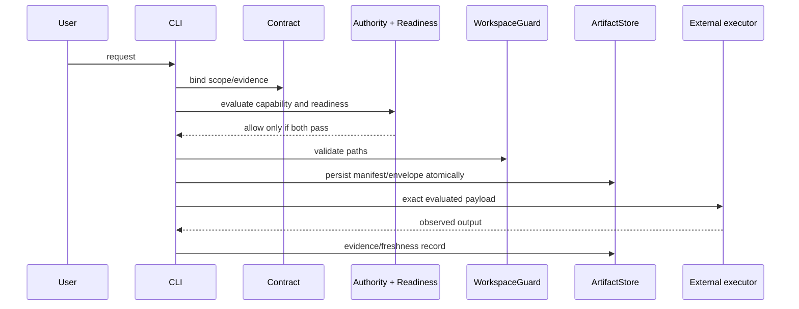

# Architecture

SotuRail v1.5 is a TypeScript/Node.js local-first engineering control plane. It stores runtime state under `.soturail/`, keeps the TypeScript implementation portable, and uses Rust only for optional benchmark-justified hot paths.

## Layers

```text
CLI / CI / IDE / host
        |
typed MCP or command adapter
        |
capability registry + contracts + dual gate
        |
workspace guard + artifact registry/store/fingerprint
        |
context / knowledge / evidence / run artifacts
        |
optional replaceable providers and executor
```

The [Verified Control Plane Architecture](verified-control-plane.md) defines the current product boundary. The [Artifact Model](artifact-model-and-lineage.md), [Governance Model](governance-model.md), [Context Architecture](context-architecture.md), and [Contracts](contracts-and-verification.md) define the current contracts.

## Runtime state

- `.soturail/config/` — validated configuration.
- `.soturail/indexes/` — heuristic repository maps.
- `.soturail/raw/` — sensitive recoverable command output and lifecycle metadata.
- `.soturail/artifacts/`, `contracts/`, `runs/`, `evidence/`, and `knowledge/` — canonical registry-managed artifacts.
- `.soturail/metrics/`, `memory/`, `rules/`, and `cache/` — local event, approved-memory, rule, and prompt-cache state.
- `evals/` — canonical repository evaluation artifacts.

Critical caller-controlled filesystem access passes through `WorkspaceGuard`. Critical artifacts use atomic persistence and carry schemas/fingerprints sufficient to detect staleness and drift.

## Command flow



## Boundaries

The repo map is heuristic, not a semantic AST graph. Provider output is attributed enrichment, not ground truth. Governance is a guardrail, not process isolation. The optional native implementation never replaces the tested TypeScript fallback.
