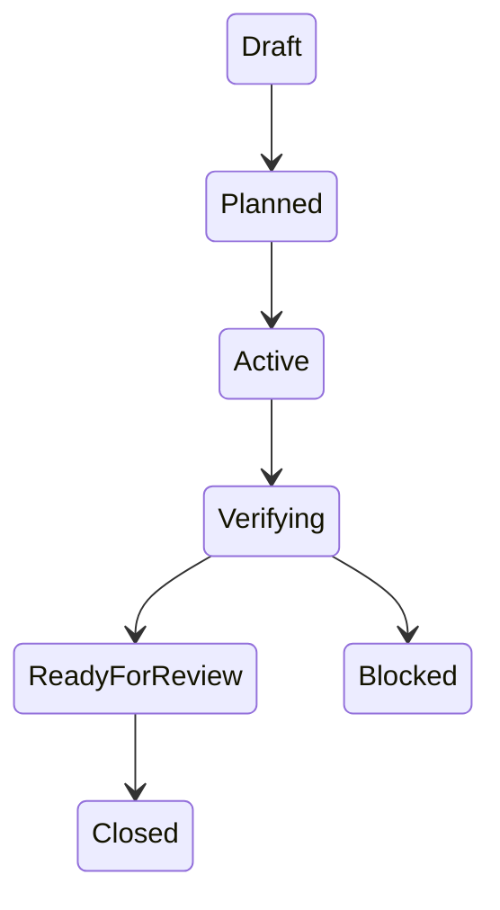
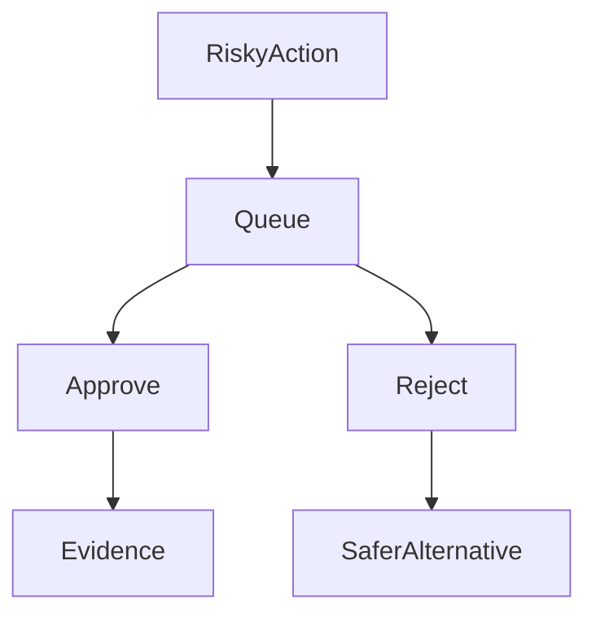
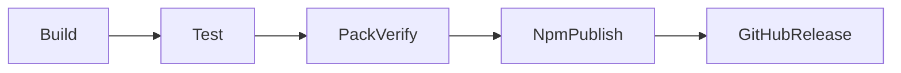

# Diagram Rail

Diagram Rail is a planned SotuRail area for using Mermaid diagrams and `.spec.md` files as compact, versioned visual context for agents.

It is inspired by Mermaid Diagram Driven Development patterns: diagram first, human approval, implementation second, tests and evidence after that. SotuRail should absorb the pattern without becoming a Mermaid-only tool.

## Product Boundary

Diagram Rail should help SotuRail express workflows, architecture, policies and context routes visually.

It should not replace normal Markdown docs, tests, code review or human approval.

```txt
Text explains.
Tests verify.
Diagrams constrain and clarify.
SotuRail connects all three as local evidence.
```

## Core Idea

```txt
diagram first -> visual approval -> implementation -> tests -> evidence
```

A diagram should be treated as a visual contract for an agent workflow, not as decoration.

Useful diagram targets:

- workflow state machine;
- release pipeline;
- MCP resource/tool flow;
- agent context handoff;
- policy approval flow;
- memory/context selection flow;
- feature `.spec.md` business rules;
- architecture module map;
- failure recovery path.

## Planned Commands

Possible future commands:

```bash
soturail diagram init
soturail diagram new <feature>
soturail diagram audit <file>
soturail diagram validate
soturail diagram from-workflow <id>
soturail workflow diagram <id>
```

These commands should generate or validate local files only. They should not auto-edit production code.

## Planned Files

Possible future structure:

```txt
.soturail/diagrams/
docs/diagrams/
docs/diagrams/release-flow.mmd
docs/diagrams/agent-context-flow.mmd
docs/diagrams/workflow-rail.mmd
docs/diagrams/policy-flow.mmd
```

Feature-level specs can use co-located files:

```txt
src/feature-name/feature-name.spec.md
src/feature-name/feature-name.mmd
```

## `.spec.md` As Visual Contract

A `.spec.md` file can combine:

- purpose;
- requirements;
- constraints;
- Mermaid diagram;
- decision matrix;
- acceptance criteria;
- test plan;
- version/change notes.

The agent should implement against the approved spec, not against a vague chat memory.

## Workflow Rail Integration

Diagram Rail should connect with Workflow Rail 2.0:

```txt
Idea -> PRD -> Diagram -> Tasks -> TDD -> Work -> Review -> Release -> Evidence
```

Future workflow evidence can include:

- diagram path;
- diagram version;
- validation result;
- related spec path;
- tasks generated from diagram;
- tests linked to diagram edges or states.

## Validation Ideas

The v0.5.1 scope is docs and a validation plan. A future diagram validator should catch practical issues:

- invalid Mermaid syntax;
- missing start/end states;
- unreachable states;
- unlabeled risky transitions;
- workflow phase missing verification;
- release path without tests/audit/pack evidence;
- context route without recovery pointer;
- policy path without approve/reject state.

Basic validation plan:

1. Check that Mermaid fenced blocks exist where expected.
2. Check that state diagrams include start or initial states when the diagram models a workflow.
3. Check that release diagrams include build/test/package verification before publish.
4. Check that policy diagrams include approve and reject paths.
5. Check that context-router diagrams include recovery/offload pointers for omitted context.
6. Report warnings only; never rewrite diagrams without explicit user action.

## Example Diagram Targets

Workflow:



Policy:



Release:



## Agent Prompt Usage

Diagram Rail should give agents compact visual context:

```markdown

```

The point is not that diagrams are magic. The point is that diagrams make state, sequence and constraints explicit in fewer tokens than long prose.

## Acceptance Criteria

Diagram Rail is successful only if:

- diagrams remain text-based and versionable;
- generated diagrams are readable by humans;
- invalid diagrams fail clearly;
- diagrams do not replace tests;
- implementation remains tied to evidence;
- no agent host is required to support Mermaid natively for the files to be useful.
