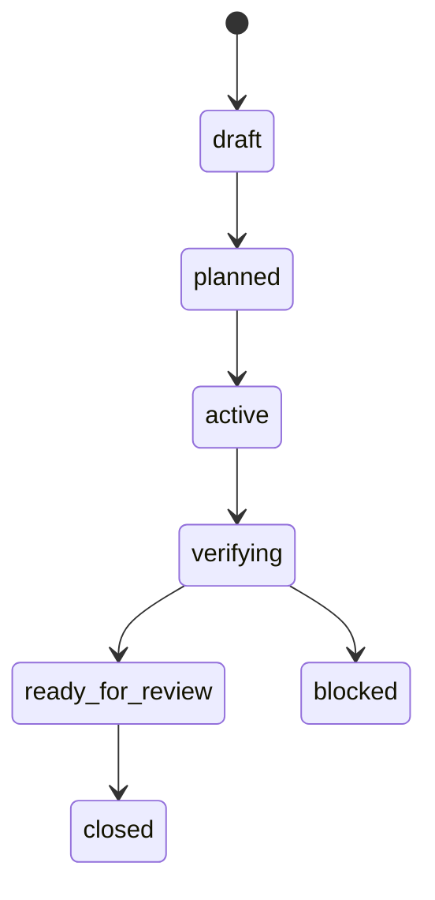

# Diagram Rail

Diagram Rail uses Mermaid diagrams and `.spec.md` files as compact, versioned visual context for agents.

It is inspired by Mermaid Diagram Driven Development patterns: diagram first, human approval, implementation second, tests and evidence after that. SotuRail absorbs the pattern without becoming a Mermaid-only tool.

## Product Boundary

```txt
Text explains.
Tests verify.
Diagrams constrain and clarify.
SotuRail connects all three as local evidence.
```

Diagram Rail should not replace normal Markdown docs, tests, code review or human approval.

## Commands

v0.7.0 implements:

```bash
soturail diagram init
soturail diagram new <feature>
soturail diagram audit <file>
soturail diagram validate
soturail diagram from-workflow <id>
soturail workflow diagram <id>
```

These commands generate or validate local files only. They do not auto-edit production code.

## Storage

```txt
.soturail/diagrams/
  index.json
  validation.json
docs/diagrams/
  <feature>.md
  <feature>.spec.md
```

`diagram init` creates both the local rail folder and the docs folder.

`diagram new <feature>` creates a Mermaid diagram plus matching visual contract.

`diagram from-workflow <id>` creates a workflow state diagram from local Workflow Rail metadata.

`diagram validate` validates all `docs/diagrams/*.md` diagrams except `.spec.md` contracts and writes `.soturail/diagrams/validation.json`.

## `.spec.md` Visual Contracts

Generated `.spec.md` files include:

```md
# Visual Contract: Feature X

## Required nodes

## Required transitions

## Evidence links

## Validation checklist

## Known gaps
```

The contract is intentionally human-readable. Agents should implement against the approved spec, not against vague chat memory.

## Audit Rules

`diagram audit <file>` checks:

- file exists;
- Mermaid block exists;
- code fences are balanced;
- matching `.spec.md` exists;
- known workflow states are referenced when applicable;
- the lightweight Mermaid validator accepts the diagram or reports findings.

The validator is deterministic and intentionally light. It catches practical issues like missing Mermaid content, unsupported diagram declarations, state diagrams without initial transitions and workflow diagrams missing verification transitions.

## Workflow Rail Integration

Diagram Rail connects to Workflow Rail 2.0:

```txt
setup -> plan -> work -> review -> verify -> evidence
```

Workflow evidence can include:

- diagram path;
- matching `.spec.md` path;
- validation result;
- generated workflow state diagram;
- release or policy diagram when present.

## Project Brain Integration

v0.8.0 Project Brain recognizes `docs/diagrams/` and `.spec.md` contracts as evidence sources.

Brain stale checks can flag source drift where a claim points at a diagram or spec range. Reverse specs can also generate gaps when diagram docs exist without matching command or validation evidence.

Diagram validation remains intentionally lightweight. SotuRail should not claim it is a full Mermaid parser.

v0.8.1 stale repair plans may include relocated diagram/spec ranges when source text moves. They are guidance only; review the `.spec.md` contract and rerun diagram validation before trusting the updated claim.

## Example Diagram



## Acceptance Criteria

Diagram Rail is successful only if:

- diagrams remain text-based and versionable;
- generated diagrams are readable by humans;
- invalid diagrams fail clearly;
- diagrams do not replace tests;
- implementation remains tied to evidence;
- no agent host is required to support Mermaid natively for the files to be useful.

Future versions can add `diagram sync`, `diagram from-repo` and richer local rendering after the workflow and evidence model is stable.

## Spec And Design Rail Connection

The post-v1 roadmap connects Diagram Rail with Spec and Design Rail:

- `spec init/check/plan` should connect PRD, requirements, design, tasks and diagrams;
- `design init/lint/diff/export` should keep dashboard/report/design guidance consistent;
- Mermaid render/diff should remain local and evidence-focused.

See [`design-rail.md`](design-rail.md) and [`spec-driven-workflow.md`](spec-driven-workflow.md).
