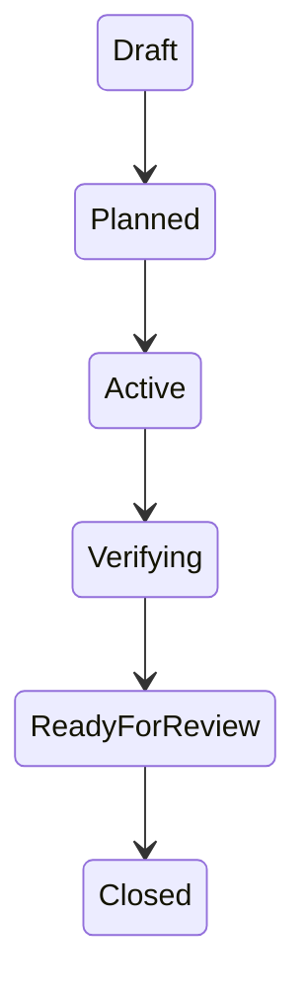

# Structured Payload Rail

Structured Payload Rail is the SotuRail area for choosing the right representation for each kind of context.

The core idea is simple:

```txt
SotuRail should not only send less context.
SotuRail should send context in the format the target agent understands best.
```

This does not mean replacing JSON with XML everywhere. It means using the right format for the right job.

## Format Rules

Default guidance:

```txt
JSON       -> machine/config/MCP/tool payloads
Markdown   -> human docs, README, ROADMAP, AGENTS.md
Tagged     -> long LLM prompt context with clear boundaries
TOON/table -> repetitive structured data
Mermaid    -> visual workflow, architecture and state context
```

## Why Not One Format?

Different consumers need different shapes.

- MCP tools and resources need strict machine-readable JSON.
- Humans need readable Markdown.
- LLM prompts often benefit from clearly delimited tagged blocks.
- Repetitive tabular records may be smaller as TOON-like or table-like payloads.
- Workflow states and architecture flows are often clearer as Mermaid diagrams.

## JSON Safety

JSON remains important, but unsafe or ambiguous JSON should be detected.

v0.5.1 adds a light local validator and a format comparison seed:

```bash
soturail validate json config.json --strict
soturail format compare docs/getting-started/usage.md
```

The strict JSON validator warns about:

- duplicate keys;
- invalid JSON;
- huge arrays without summaries;
- probable secrets;
- machine payloads that need review before agent handoff.

It is intentionally small. It is not a schema registry or a full linter.

Example output shape:

```txt
SotuRail JSON strict validate
file: config.json
strict: true
valid_json: true
result: warn
duplicate_keys: 1
probable_secrets: 0
huge_arrays: 0
```

## Markdown For Human Docs

Use Markdown for README files, migration guides, policy docs and agent-facing procedures. Markdown is easy to review in a PR and can contain links to generated `.soturail/` artifacts.

Good fit:

- project identity;
- build/test/release commands;
- safety rules;
- explanation with links.

Poor fit:

- large repeated records;
- machine contracts that need strict parsing;
- secret-bearing data.

## JSON For Machine Contracts

Use JSON for MCP manifests, package metadata, config files and strict tool contracts. Validate it before using it as an agent handoff payload:

```bash
soturail validate json .soturail/config/config.json --strict
```

Safety notes:

- duplicate keys can hide intent;
- huge arrays should be summarized or offloaded;
- probable secrets should be redacted;
- ambiguous payloads should include a schema or explanation.

## Tagged Context Blocks

For LLM context, SotuRail can emit XML-like tagged blocks without requiring a strict XML parser.

Example:

```xml
<soturail_context version="0.5.x">
  <project>
    <name>SotuRail</name>
    <goal>Local-first Context OS for coding agents.</goal>
  </project>

  <rules>
    <rule>No arbitrary shell execution through MCP.</rule>
    <rule>Prefer approved memory over raw logs.</rule>
  </rules>

  <repo_map>
    ...
  </repo_map>

  <terminal_summary>
    ...
  </terminal_summary>
</soturail_context>
```

Call this `tagged context` or `XML-like tagged context`, not mandatory XML.

Tagged blocks are useful when an LLM needs long prompt context with clear boundaries:

```xml
<release_evidence source="docs/reference/commands/release-workflow.md">
  npm publish must finish before the GitHub release is created.
</release_evidence>
```

They should not replace JSON for machine contracts.

## Compact Tables And TOON-Like Summaries

Repeated rows can be shorter and clearer as a compact table:

```txt
id | state | owner | evidence
wf_1 | verifying | release-manager | .soturail/workflows/wf_1/verification.md
wf_2 | active | executor | .soturail/workflows/wf_2/tasks.md
```

Use this for summaries, not for precise machine parsing.

## Mermaid For Visual Context

Mermaid belongs in diagrams, specs and workflow context:



Use Mermaid when state transitions, release flows or policy decisions would be longer as prose.

## Target-Aware Context Packs

Context packs still use target-aware Markdown today. The v0.6.0 Agent Runtime Adapter also reports host-aware payload recommendations:

```bash
soturail agents capabilities
soturail agents explain --agent all
soturail agents doctor --verbose
```

Possible future context-format command shapes:

```bash
soturail context pack --target claude --format tagged
soturail context pack --target gemini --format tagged
soturail context pack --target codex --format markdown
soturail context pack --target generic --format markdown
soturail context pack --target mcp --format json
```

Suggested defaults:

| Target | Preferred context shape |
| --- | --- |
| Claude | tagged blocks + Markdown summary |
| Gemini | tagged blocks or Markdown summary |
| Codex | concise Markdown + JSON only for configs/tools |
| Cursor | rules + Markdown context |
| Antigravity | prompt-only Markdown/tagged fallback until stable format is known |
| MCP | JSON |
| Generic | Markdown |

Additional host guidance:

- OpenCode/Amp/Kiro-style hosts: Markdown + JSON reports + prompt-only fallback until stable local project surfaces are confirmed.
- Deep Agents-style exports: role packs, workflow evidence and policy notes as context/config artifacts only.
- Claude safe-hooks templates: Markdown docs plus reviewed JSON settings, never arbitrary shell exposure.

## Format Comparison Report

`soturail format compare <file>` gives a local, approximate first pass:

```bash
soturail format compare docs/getting-started/usage.md
```

The report includes:

- raw token estimate;
- Markdown-ish estimate;
- JSON minified estimate when the file is valid JSON;
- tagged-block estimate;
- compact/table suggestion for repetitive content;
- warning that estimates are local and approximate.

v0.5.2 should add quality fixtures that check whether important facts, paths, errors and security warnings survive formatting.

## Relationship With Reducers

Reducers decide what content survives.

Structured Payload Rail decides how surviving content is represented.

Both must preserve:

- file paths;
- exact commands;
- error messages;
- expected/actual values;
- security warnings;
- raw recovery IDs;
- source paths and line ranges where available.

## Acceptance Criteria

Structured Payload Rail should not be promoted until:

- JSON remains available for machine consumers;
- Markdown remains available for humans;
- tagged context is optional and documented;
- duplicate-key validation is tested;
- benchmark fixtures compare markdown vs tagged vs JSON vs compact formats;
- quality checks prove important evidence survives formatting.
