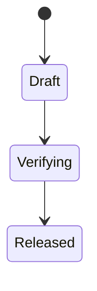

# Tutorial: Diagram Rail And `.spec.md`

Use diagrams as local visual contracts. Diagrams guide implementation, but they do not replace tests, review or policy approval.

Create a `.spec.md` with Markdown requirements and Mermaid:

````markdown
# Feature Spec


````

Then pair it with SotuRail evidence:

```bash
soturail context pack --role planner
soturail workflow new "Implement diagram-backed feature"
soturail eval run
```

v0.6.1 includes lightweight Diagram Rail validation fixtures in the evaluation suite. Future v0.7 work can add fuller diagram commands.
